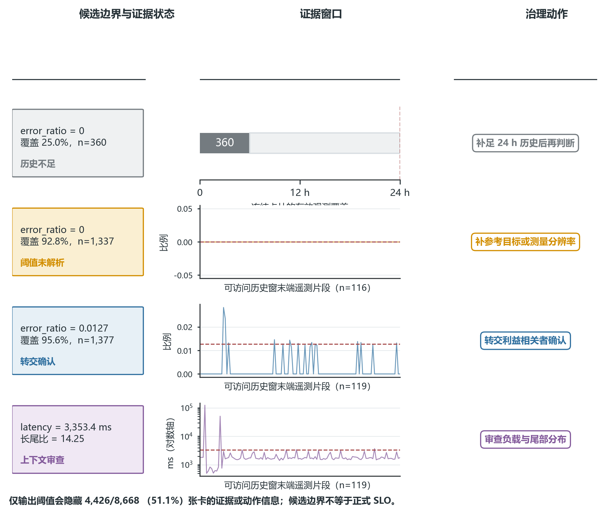
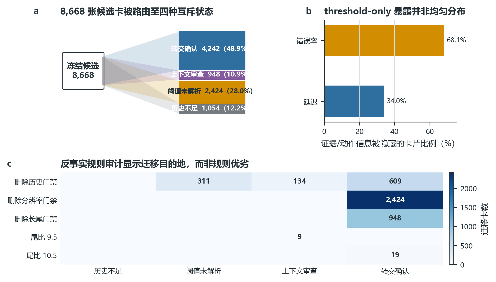
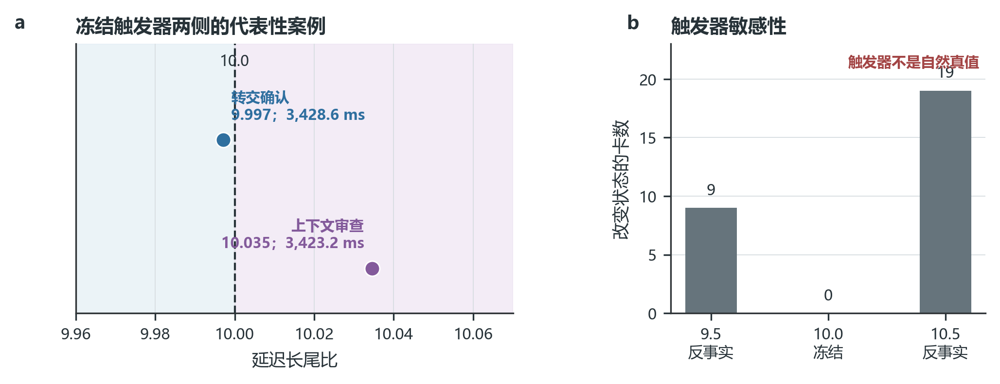
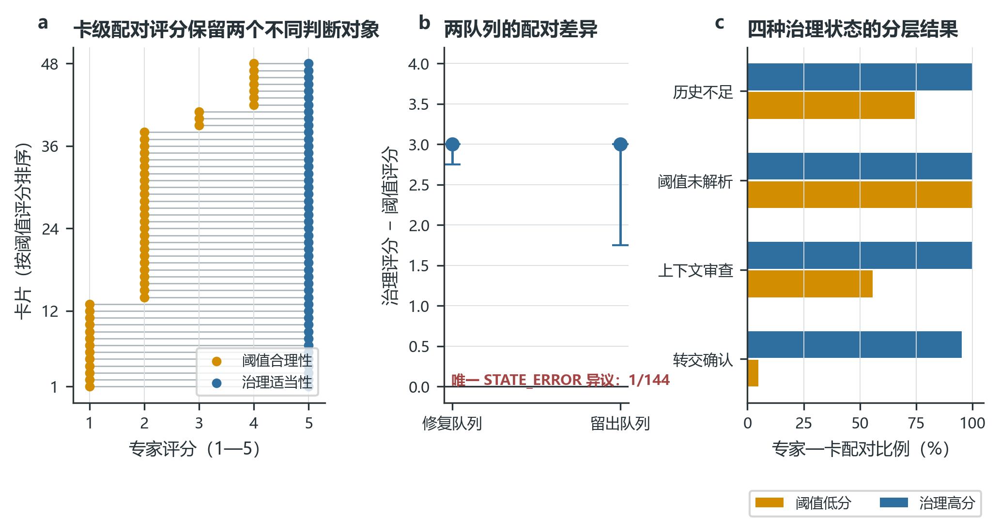
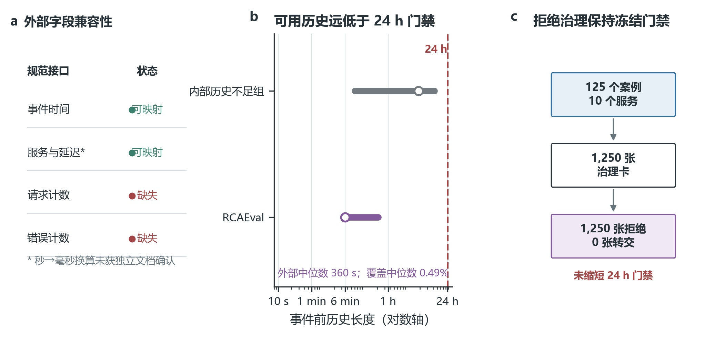
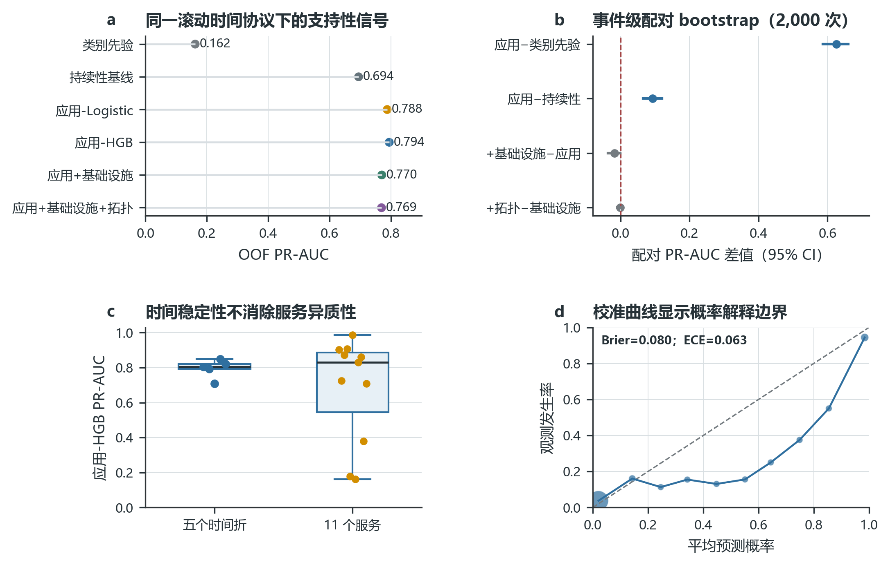

# 缺少显式 SLO 的云原生运行时非功能需求操作化：候选边界的有效性审计与证据感知治理

**作者：** 谢华澄，张宇，吕嘉琪，杜庆峰*  
**单位：** 同济大学计算机科学与技术学院  
**英文署名：** Xie Hua Cheng, Zhang Yu, Lv Jia Qi, Du Qing Feng*  
**英文单位：** School of Computer Science and Technology, Tongji University, Shanghai 201804, China  
**通信作者：** 杜庆峰（Du Qing Feng，Du_cloud@tongji.edu.cn）

## 摘要

云原生团队通常拥有丰富遥测，却未必具有经利益相关者确认的服务级目标（SLO）。在这种条件下，关键不是从历史数据中再生成一个数值，而是判断该数值是否具备进入需求决策的证据。本文提出证据感知的运行时非功能需求（NFR）候选治理方法：从事件前遥测生成可追溯候选边界，并依据历史充分性、测量分辨率和长尾上下文，将候选路由至补证、未解析、上下文审查或利益相关者确认。对 8,668 张冻结候选卡的分析表明，最小 threshold-only 输出虽然保留全部数值，却会隐藏 4,426 张（51.1%）卡的证据状态和责任路由；删除历史、分辨率和长尾门禁分别改变 1,054、2,424 和 948 张卡的处置。第二轮三名独立专家对 48 张卡形成 144 个配对判断：阈值合理性中位数为 2/5，治理适当性在 143/144 个配对中更高，且 48/48 张卡的治理适当性中位数不低于 4。人工证据重建进一步支持实现一致性，独立协议数据集表明冻结拒绝路径在输入条件不满足时仍能执行；滚动预测消融用于界定候选信号的下游使用范围。本文将候选生成、证据审计、显式拒绝和人工批准权连接为可复核的需求工程责任链，使“何时可以转交、何时必须停止”成为方法的明确输出。

**关键词：** 非功能需求；服务级目标；运行时需求；证据治理；云原生；人在回路；可追溯性

## Abstract

Cloud-native systems often accumulate abundant telemetry but lack stakeholder-approved service-level objectives (SLOs). Historical quantiles describe observed behavior, whereas SLOs prescribe intended service behavior. We present an evidence-aware method for governing candidate runtime non-functional requirements (NFRs). The method generates traceable candidate boundaries from pre-event telemetry and routes them according to history sufficiency, measurement resolution, and tail context. The four destinations are evidence collection, unresolved-threshold handling, context review, and stakeholder review. Across 8,668 frozen candidate cards, a threshold-only output retains every value but omits evidence states and responsibility routes for 4,426 cards (51.1%). Removing the history, resolution, and tail gates changes the dispositions of 1,054, 2,424, and 948 cards, respectively. In a second-round independent review, three experts provided 144 paired judgments on 48 cards. Median threshold plausibility was 2/5, while governance appropriateness was higher in 143/144 pairs and reached a card-level median of at least 4 for all cards. Manual evidence reconstruction supported implementation consistency, and an independent protocol-audit dataset exercised the frozen refusal path. Rolling-time prediction ablations delimited downstream use; none of these analyses established threshold correctness or formal SLO approval. The contribution is an auditable requirements-engineering responsibility chain connecting candidate generation, evidence auditing, explicit refusal, and retained human approval authority.

**Keywords:** non-functional requirements; service-level objectives; requirements at runtime; evidence governance; cloud-native systems; human-in-the-loop governance; traceability

## 1 引言

需求规约回答“系统应当满足什么”，历史遥测记录“系统曾经如何运行”；两者在语义上不能互换[1]。NFR 又具有跨生命周期、难以枚举和难以直接操作化的特点[2-3]。这一差异在云原生系统中尤为突出：团队持续采集请求量、错误率、延迟和资源指标，却常常缺少由业务、产品和运维共同确认的 SLO。若不利用这些遥测，NFR 容易停留在“高可用”“低延迟”等不可检验表述；若直接采用历史分位数，又会把偶然负载、数据缺失、测量分辨率和既有性能固化为规范。缺少显式 SLO 时，真正需要解决的是如何把遥测转化为可讨论的需求候选，同时保留“暂不操作化”的能力。

运行时需求研究已将监测、不确定性和运行时模型引入需求推理[4-10]，但通常从既有目标或可接受区间出发。SRE 实践同样明确区分 SLI 与 SLO：前者是测量，后者是由用户关切和产品决策共同确定的目标[11-12]。现有方法由此留下一个关键空缺：当正式目标尚不存在时，系统既要利用历史遥测形成可测量候选，又要避免证据不足的候选越过规范决策边界。

本文提出证据感知的 Runtime NFR 治理链。方法保留原始候选阈值，并为每个候选附加证据卡和责任路由：证据满足冻结门禁的卡片进入利益相关者确认，历史不足、零错误基线未解析和延迟长尾异常则分别进入补证、未解析和上下文审查。这样，拒绝直接操作化不再是样本损失，而是与候选数值同等明确的方法输出。研究回答四个问题：

- **RQ1：** 历史遥测能够以多大覆盖率生成可测量、可追溯的候选 NFR 边界？
- **RQ2：** 覆盖率、样本量、测量分辨率和长尾异常如何影响候选边界的证据状态？
- **RQ3：** 独立专家是否认可接受确认、拒绝操作化、补充证据或上下文审查等治理处置？
- **RQ4：** 候选治理链在实现一致性、独立协议数据集、下游使用与表示扩展四类边界上的可信范围如何界定？

本文作出三项贡献。第一，提出“候选边界—证据审计—治理分流—人工确认”的需求工程责任链，以可执行卡片协议保留候选的来源、证据状态和目标批准权。第二，在同一组冻结卡片上，通过 threshold-only 对照、规则反事实和边界敏感性量化治理层新增的信息与责任去向，并以两轮独立专家评审提供“阈值合理性”与“治理适当性”可被区分的配对证据。第三，建立失败保持的边界审计，将实现重建、独立数据拒绝、下游信号和表示扩展分别置于明确的验证职责中，使方法的可信范围能够被复核，而不依赖事后调整阈值或选择性呈现结果。

**图 1　相近候选数值在不同证据条件下进入不同治理动作。** 四行依次展示历史不足的零错误率候选、充分历史下仍无法解析的零错误率候选、错误率为 0.0127 的可转交候选，以及长尾比为 14.25 的延迟候选。第一行按冻结卡片统计展示 360/1,440 的有效观测覆盖；其余三行展示可访问原始文件与对应历史窗相交的末端遥测片段（各 116–119 个分钟观测），虚线为卡片中的候选边界，完整门禁判断仍以冻结卡片统计为准。相同或相近数值因此分别触发补历史、补参考目标/分辨率、转交确认和上下文审查。全集含 8,668 张卡，最小化的“只给阈值”输出会隐藏 4,426 张（51.1%）卡的证据或动作信息；候选边界不等于正式 SLO，专家评价不等于利益相关者批准。

## 2 背景与相关工作

### 2.1 NFR、SLO 与运行时需求

ISO/IEC 25010 将性能效率、可靠性等作为可规定、测量和评价的软件质量特性[13]。OpenTelemetry 和 OpenMetrics 提供了指标、日志、追踪、单位和标签的交换语义[14-15]，却不决定某个业务是否应接受具体目标。现有运行时需求工作强调监测和自适应，但较少处理“目标值尚未由利益相关者给出”的情形。本文因此把历史统计量定义为候选边界，并为“可测量”与“应当接受”设置不同判定层。

### 2.2 遥测阈值学习与异常检测

遥测异常检测可借助极值理论学习动态阈值[18]，也可从日志序列[19-20]或多变量时序[21-22]学习正常模式。已有研究同时揭示了表示变化和数据漂移对外部稳定性的影响[23-24]，基准研究也强调时间结构与可复现评价[25]。这些方法主要优化异常区分，而本文关注阈值成为需求候选之前的证据责任。我们不以模型分数替代利益相关者判断，也不因某一阈值在训练数据上区分良好就把它升级为正式 SLO。

### 2.3 证据与测量质量

数据质量不仅是数值准确，还包括完整性、可解释性、及时性等维度[16]。测量不确定性规范要求保留可复核信息[17]；缺失机制、数据质量过程、仪器分辨率和软件数据质量模型也会改变结论[26-29]。据此，本文把历史覆盖、有效样本、零错误基线和长尾比率作为一等证据字段。治理状态是方法输出，而不是清洗后被隐藏的缺陷标签。

### 2.4 人在回路治理

自动化水平应与决策阶段和风险相匹配[30]；可信系统应支持恰当依赖、异常校正和退出[31-32]。数据依赖与隐式反馈还会积累技术债[33]，而算法错误可能触发过度拒绝[34]。本文因此不让模型批准 SLO：算法负责形成候选和证据说明，专家评价卡片与治理动作，利益相关者保留目标确认权。

### 2.5 早期预测、统计评价与拓扑特征

类别不平衡任务中，PR-AUC 比 ROC-AUC 更直接反映阳性识别质量[35-36]，而概率校准需与排序能力分开报告[37]。一致性统计也受边际分布和零方差影响[38-39]。微服务诊断研究已利用指标、调用传播、追踪和多源图结构定位根因[40-46]；GraphSAGE 和图卷积等方法为拓扑表示提供基础[47-48]。不同于根因定位，本文预测任务是故障发生前的应用—事件越界风险排序；拓扑仅作为预先冻结的一组特征，不承担主要方法贡献。

### 2.6 与现有技术路线的差异

2022—2026 年与本文最接近的研究主要沿三条路线展开。第一条路线从用户交互发现运行时需求模型[49]，或从服务属性和实体图推荐监控对象、指标、表达式与告警条件[50,66]。第二条路线利用运维干预、工程师反馈和历史告警提升告警的可操作性，包括 REFORM、TraceArk、主动学习告警抑制和动态告警策略[51-54]。AlertGuardian 进一步把告警去噪、摘要和规则改进组织为生命周期，并报告 1,174 条改进规则中有 375 条获 SRE 接受[65]；AutoKAD 则在无标签条件下选择 KPI 异常检测器及超参数[55]。这些研究说明运行证据与人工反馈能够改善监控决策。本文关注其中尚未被单独建模的责任转换：历史数值何时具备成为需求候选的证据，以及规范目标最终由谁批准。

第三条路线围绕既有 SLO、容量目标或测量充分性展开。高层 SLO 扩散将已有业务目标下推为微服务约束[56]，预测性 SLO 监控从低层遥测预测既定目标的行为[57]。无真值容量估计通过自一致性过滤评估外推可靠性[67]，自适应停止规则依据确定性要求决定是否继续采集性能测量[58]；工业告警反模式研究则揭示告警配置和证据使用中的质量风险[59]。本文吸收其中的可靠性过滤、继续采集和配置审计思想，并进一步把历史覆盖、测量分辨率和长尾上下文映射为补证、未解析、上下文审查和利益相关者确认四类责任动作。

故障前预测为候选边界的下游使用提供了相邻参照。InstantOps 联合多源遥测、时序模型与图结构执行故障预测和根因定位[60]，动态多预测器系统预测微服务性能退化[61]，SuanMing 利用应用性能监控和拓扑解释未来退化[62]。时间序列评价研究进一步表明，数据切分、数据集性质和评价协议会改变性能结论[63-64]。据此，本文将六模型消融设置为支持性边界审计，用于判断候选边界附近是否存在故障前应用信号；独立协议数据集则用于检验统一接口能否保持冻结拒绝规则。两者服务于治理链的可信范围，而非另行争夺预测算法或跨数据集性能优势。

表 1 按决定机制比较这些最近邻。本文聚焦一个明确场景：系统只有历史遥测、尚无经确认目标。方法在保留候选数值的同时审计证据责任，并允许系统拒绝直接操作化。其核心能力是把候选边界、证据审计、显式拒绝和利益相关者批准权组合为可追溯的需求工程治理链。

**表 1　本文与相邻技术路线的定位比较**

| 路线/代表工作 | 已有 SLO | 生成候选数值 | 审计证据质量 | 拒绝/转交 | 保留目标批准权 | 独立/外部验证 | 与本文的决定性差异 |
| --- | --- | --- | --- | --- | --- | --- | --- |
| 运行时需求发现[49] | 否 | 否 | 部分 | 否 | 不明确 | 真实系统展示 | 从交互发现目标模型，不处理服务遥测数值边界 |
| 智能监控推荐[50,66] | 否 | 否 | 部分 | 否 | 部分 | 工程师研究/用户研究 | 推荐监控对象、指标和配置，不输出候选 NFR 数值 |
| 告警价值、抑制与生命周期[51-55,59,65] | 否/部分 | 部分 | 部分 | 部分 | 通常否/部分 | 生产或多数据集 | 反馈用于告警模型、规则或策略优化，不保留规范目标批准层 |
| SLO 扩散与预测监控[56-57] | 是 | 否 | 部分 | 部分 | 否/不明确 | 微服务实验 | 高层目标已存在，不发现规范性目标 |
| 无真值容量可靠性估计[67] | 否 | 是 | 是 | 部分 | 否 | 大规模分布式系统 | 估计容量并过滤不可靠外推，不治理规范目标候选 |
| 测量充分性停止[58] | 否 | 否 | 是 | 是 | 否 | 合成与真实基准 | 判断何时继续采集，不治理候选目标 |
| 故障前预测与诊断[60-62] | 否 | 否 | 部分 | 否 | 否 | 多数据集/系统 | 预测故障或退化，不生成需求候选 |
| 本文 | 否 | 是 | 是 | 是 | 是 | 专家、人工及独立数据集边界审计 | 组合候选、证据责任、拒绝和批准权保留 |

## 3 研究方法

### 3.1 研究对象与总体协议

主要分析数据为公开的 **AIOps Challenge 2025 Dataset**[68]。本文固定到官方 GitLab 的 `AIOps2025` 发布快照（commit `57c36fa46fb2f4dec19b5f5ca9cbf5a90f9c9e00`，下载地址见[68]），其许可为 CC BY-NC 4.0。该数据基于 Kubernetes 上的 Hipster Shop 微服务测试床，通过受控故障注入采集指标、日志、调用链和故障标注；本文使用其中服务、Pod 和节点的分钟级指标、故障标注及拓扑信息，转换为 27 个拓扑分段，其中 24 个分段含 394 个事件。该公开基准代表受控微服务测试床中的故障与遥测，不代表不同组织、业务负载、遥测平台或真实生产变更的总体。

候选卡覆盖服务级延迟、错误率等 SLI；生成阶段仅使用故障发生前可获得的信息。所有结果采用滚动时间协议，模型训练、阈值生成、人工核查抽样和独立协议数据集审计的角色在分析前冻结。定量结果由冻结 JSON/CSV 生成，并以文件哈希保持数据、分析与图表之间的可追溯关系。

### 3.2 候选边界卡

每张卡至少包含：卡片 ID、父卡 ID、服务、SLI、单位、原始候选阈值、统计窗口、有效样本数、历史覆盖、来源证据、适用上下文、治理标记和建议后续动作。原始阈值在治理实验中不可回调，避免因专家评分或独立数据集结果进行事后调参。

候选生成使用事件前 24 h 分钟级历史，并排除与同一服务其他已知事件重叠的区间。令观测序列为 \(X\)，其中位数为 \(m\)，中位绝对偏差为 \(\mathrm{MAD}\)，稳健尺度固定为：

\[
s=\max(1.4826\times \mathrm{MAD},10^{-6}).
\]

主候选使用 0.95 分位数 \(Q_{0.95}(X)\)，原始候选边界为：

\[
b=\max\left(Q_{0.95}(X),m+3s\right).
\]

若错误率历史全部为零，则保留 \(b=0\)，并在治理层将其标记为零基线未解析，而不是用尺度下限制造一个非零目标。该规则生成的是历史行为候选，不是业务认可的 SLO。

令历史窗口内有效分钟数为 \(n_v\)，预期分钟数为 \(n_e=1,440\)，历史覆盖率为：

\[
C_h = \frac{n_v}{n_e}.
\]

历史充分性门要求 \(C_h\geq 0.5\) 且 \(n_v\geq 720\)。在固定 24 h 分钟级窗口下，两项数值条件等价，但卡片同时保留覆盖率和有效样本数，以便审计窗口定义或采样粒度变化。延迟卡另记录稳健尺度标准化尾差：

\[
R_t = \frac{Q_{0.95}(L)-m}{s},
\]

其中 \(L\) 为历史延迟观测，\(m\) 和 \(s\) 分别为其中位数和上述稳健尺度。主规则固定 \(R_t=10.0\)，9.5 和 10.5 仅用于探索性敏感性分析。

### 3.3 证据状态与治理动作

治理层按冻结优先级将卡片分为四类：

1. `insufficient_evidence`：\(C_h<0.5\) 或 \(n_v<720\)，动作是补充历史，禁止直接操作化；
2. `threshold_unresolved`：错误率的 \(Q_{0.95}\)、中位数和 MAD 均为零，或候选仅由 \(10^{-6}\) 稳健尺度下限产生，动作是获取参考目标、提高分辨率或征询利益相关者；
3. `needs_context_review`：如延迟长尾比率达到 10，动作是审查工作负载混合与尾部分布；
4. `candidate_for_stakeholder_review`：证据未触发上述拒绝规则，可转交利益相关者，但不等于 SLO 已获批准。

0.5、720 和 10.0 均是研究协议在正式结果前冻结的工程治理门禁，不是从当前结果中学习得到的统计最优值。覆盖率与有效样本数在当前 24 h 分钟级窗口下数值等价，但分别保留二者，可使窗口长度或采样粒度变化后的责任条件继续可审计；10.0 只触发尾部解释责任。已有研究表明，测量充分性与可靠性可以作为显式决策对象[58,67]。本文进一步通过删规则、换序和 9.5/10.5 敏感性分析审计各门禁的决策作用，并保持预先冻结的主规则不变。

该优先级使高风险证据问题不会被总体样本量掩盖。

为隔离治理层新增的信息，本文定义最小 `threshold-only` 对照：在同一 8,668 张冻结卡上只输出原始候选数值，不提供证据状态、拒绝原因或后续责任路由。比较对象由此从“谁估计出更准的阈值”转为“治理层额外暴露了哪些决策信息”。规则删除、优先级交换以及 9.5/10.5 长尾门限均作为反事实审计，用于追踪冻结规则如何改变处置，不参与规则重选。

### 3.4 专家评审

第一轮由 3 名专家评价 48 张核心卡，共 144 行评分，维度包括清晰性、可测量性、可追溯性、阈值合理性和运行时可操作性。第二轮由 3 名未参与第一轮的新专家评价 24 张修复卡和 24 张全新留出卡，共 144 行。专家未接触第一轮评分、私有抽样分层、未来越界或模型结果，但卡片按研究目的保留证据状态、治理标记和建议动作；因此该设计盲化了结果与队列来源，并未盲化被评价的治理机制。第二轮主要终点预先定义为：至少 75% 卡片的 `governance_appropriateness` 卡级中位数不低于 4。阈值合理性与治理适当性分开测量，以避免把“认可拒绝或转交”误写成“认可阈值”。

### 3.5 匹配证据人工核查

从冻结匹配结果中选择 20 个事件—服务组，每组包含 3 个非事件对照，共 60 行。核查材料提供对照窗口、历史请求量、循环小时差、匹配距离、候选排名、历史与未来样本、故障缓冲区重叠及原始指标路径；隐藏事件和对照越界结果、差值及方向。四名核查人分别在独立工作簿中完成同一批 60 行逐对照和 20 行组级结论，并以唯一匿名 ID 签署。

汇总程序硬性校验四个唯一 ID、四份不同文件哈希、每人 60+20 条记录、合法结论、问题代码完整性，以及证据列相对空白模板未变化。返还文件先冻结并记录 SHA-256，再与私有方向数据解盲。由于所有结论无变异，只报告原始一致率，不计算或解释 κ 或 α；高原始一致率与低或不可解释的机会校正一致性可以并存[38-39]。人工核查的验证职责限定为匹配实现与证据重建一致；因果效应、阈值正确性和正式 SLO 不属于该审计终点。

### 3.6 独立协议数据集适配

独立数据集按预设顺序审计。FIRM 因无法满足连续时间协议被拒绝；公开的 RCAEval RE1-OB[44,69] 被选为唯一独立协议审计数据集，角色冻结为 `validity_only`。“独立”表示其相对于主要 AIOps2025 分析数据单独发布且未参与规则、阈值、特征或模型选择，不表示“内部数据与外部数据”的所有权区分。本文使用 Zenodo record `14590730` 中的 `RE1-OB.zip`（DOI 与下载地址见[69]，CC BY 4.0）。适配器把 125 个独立案例、10 个服务和 44,980 行观测转换为统一接口，并生成 1,250 张治理卡。该数据没有正式 SLO，因此审计终点设为接口适配与拒绝路径；冻结的 24 小时历史要求保持不变，历史不足的卡片进入拒绝状态。

### 3.7 预测消融

下游任务使用五折滚动时间 OOF，比较六个预先固定的模型：类别先验、persistence、App-only Logistic、App-only HGB、App+基础设施 Logistic、App+基础设施+冻结拓扑 Logistic。类别先验取各训练折的阳性率；persistence 取故障前早期窗口中延迟与错误越界比例均值的较大者。主指标为适合类别不平衡任务的 PR-AUC[35-36]，另将 Brier 和 ECE 作为与排序性能分离的概率校准指标[37]，并报告 Recall@3 和 NDCG@3。模型差值以事件为聚类单位执行 2,000 次配对 bootstrap，避免把同一事件内多个应用当作独立样本。`fault_type`、事件持续时间、结果目标和 `impact_score` 等运行时不可知字段禁止进入特征。

五个测试折按时间依次覆盖 2025-06-09—06-11、06-11—06-13、06-13—06-17、06-17—06-19 和 06-19—06-21；折级、服务级和十等宽校准箱均从 OOF 预测生成。应用特征中有 14 个 `exceedance` 字段使用冻结候选边界构造，但只读取故障前窗口。它们不是结果后泄漏，却与越界标签在构造上接近，因此预测只能检验“候选边界附近是否存在故障前应用信号”，不能作为标签构念的独立验证。滚动时间与数据切分对时间序列评价结论的影响参照严格评价协议[63-64]处理。

### 3.8 可追溯数据链与硬失败规则

研究数据链包含四类可追溯对象：只读公开输入，治理卡、专家标准化评分、独立数据适配和 OOF 预测等分析制品，人工签署原件，以及论文表格与图形。每个下游 JSON 均记录直接输入路径和 SHA-256，图表清单同时记录文件字节数与哈希。由此，正文中的定量主张可以回溯到分析制品及其直接输入。

自动汇总采用硬失败策略。源文件数、核查人 ID、工作簿哈希、逐对照与组级记录数、结论值、问题代码或证据列任一不符合冻结协议，生成过程即终止。正式结果审计进一步核对第二轮 144 行评分、48 张卡和 3 名专家，逐卡保持原始阈值不变，隔离独立协议数据集，统一六模型的事件—应用键，并检查禁止特征和标签时间顺序。

数字冻结采用版本化基线区分错误修复与结果导向调整。实现修复必须在新目录中重跑并比较差异，既有结果目录保持不变；文字和图注的修订不得改变冻结数值。这一机制使失败能够被显式暴露和追踪，而不是被下游流程静默吸收。

表 2 汇总可由冻结制品重建的审计规模，并按记录、判断和模型输出计量。两轮专家共形成 288 行评分，独立协议数据集适配处理 44,980 行观测，六模型产生 13,356 行 OOF 输出。CPU、峰值内存和各阶段墙钟时间未形成统一历史记录，因此不进入计算效率比较。

**表 2　冻结研究与审计工作量**

| 环节 | 可审计工作单元 |
| --- | ---: |
| 主要公开数据候选治理 | 8,668 张卡 |
| 两轮专家评审 | 6 名专家、96 个卡片评审单元、288 行评分 |
| 匹配证据人工核查 | 4 人、240 个逐对照判断、80 个组级判断 |
| 独立协议数据集适配 | 125 个案例、10 个服务、44,980 行观测、1,250 张卡 |
| 滚动预测消融 | 6 个模型、209 个事件、每模型 2,226 个 event-app 对、合计 13,356 行 OOF |
| 拓扑边界审计 | 394 个事件、22 个拓扑哈希 |
| 自动验证 | 41 项相关测试、6 类正式审计检查 |

## 4 结果

### 4.1 RQ1：候选边界覆盖与可追溯性

共生成并冻结 8,668 张候选边界卡。每张卡均可追溯至服务、SLI、单位、历史窗口和父卡，原始候选阈值相对上一版逐卡保持一致。冻结事件—服务—SLI 设计单元均形成卡片，其中 87.8% 通过历史门禁，48.9% 通过全部证据门禁并进入利益相关者确认队列。第一轮专家对清晰性、可测量性和可追溯性的总体评分中位数均为 5/5，48/48 张核心卡通过预设表达门槛。结果说明，历史遥测能够规模化形成机器可读、人工可审查的候选规约；治理层随后决定这些候选是否具备进入目标确认的证据。

### 4.2 RQ2：证据状态与敏感性

表 3 给出治理分布。4,242 张（48.9%）卡进入利益相关者确认队列，另外 4,426 张（51.1%）触发补证、未解析或上下文审查。最小 `threshold-only` 输出仍会给出全部 8,668 个候选数值，却无法呈现这 4,426 张卡的证据状态和责任路由。治理层由此增加的核心信息不是另一个阈值，而是候选下一步应由谁、基于什么证据处理。阈值未解析是规模最大的状态，共 2,424 张（28.0%）；它将零错误基线和测量分辨率问题从“零错误 SLO”中区分出来。

证据责任在不同 SLI 和服务间呈现清晰差异。错误率卡中有 2,951/4,334（68.1%）进入补证、未解析或上下文审查，延迟卡为 1,475/4,334（34.0%）；11 个服务的相应比例为 11.9%—60.5%。历史覆盖低于 0.5 的 1,054 张卡全部需要补充历史，而覆盖不低于 0.75 的卡仍有 44.4% 因分辨率或尾部上下文需要进一步处理。日期和 segment 分层均可加总回 8,668。这些分层定位了证据责任最集中的场景，为后续采集和人工审查提供直接入口。

**表 3　冻结候选边界的治理分布**

| 治理状态 | 卡片数 | 比例 | 主要动作 |
| --- | ---: | ---: | --- |
| 历史证据不足 | 1,054 | 12.2% | 补充历史后再评估 |
| 阈值未解析 | 2,424 | 28.0% | 获取参考目标、分辨率或利益相关者输入 |
| 需上下文审查 | 948 | 10.9% | 审查负载混合与尾部分布 |
| 可转交利益相关者确认 | 4,242 | 48.9% | 转交确认，不视为 SLO 批准 |

**图 2　治理路由、threshold-only 暴露分层与反事实迁移（n=8,668）。** a，冻结候选被路由至四种互斥状态：历史不足 1,054、阈值未解析 2,424、上下文审查 948、转交确认 4,242。b，若只输出阈值，错误率卡和延迟卡中分别有 68.1% 与 34.0% 会失去证据或动作信息；分母均为该类 SLI 的 4,334 张卡，该比例不是错误率或准确率。c，颜色深浅和数字给出规则反事实后的迁移目的地：删除历史门禁的 1,054 张卡分别迁移到阈值未解析 311、上下文审查 134、转交确认 609；删除分辨率或长尾门禁分别使 2,424 和 948 张卡迁移到转交确认；将长尾触发器反事实改为 9.5 或 10.5 分别使 9 张候选迁移到上下文审查和 19 张上下文审查卡迁移到转交确认。所有反事实仅审计冻结规则的决策作用，不用于重选规则或宣称阈值最优。

规则触发数与最终状态数并不相同，因为一张卡可能同时具有多个证据缺口，而冻结优先级只分配一个主状态。独立触发交集显示，609 张卡只触发历史门禁，311 张同时触发历史与分辨率门禁，134 张同时触发历史与长尾门禁；2,424 张只触发分辨率门禁，948 张只触发长尾门禁，4,242 张不触发三类门禁。删除历史门禁后，原 1,054 张历史不足卡分别迁移至阈值未解析 311 张、上下文审查 134 张和转交确认 609 张；删除分辨率或长尾门禁则分别使 2,424 张和 948 张卡转入确认队列。规则因此改变的是具体责任去向，而不只是类别名称。

长尾主规则固定为 10.0。探索性地改为 9.5 和 10.5 时，分别有 9 张和 19 张卡在 `needs_context_review` 与 `candidate_for_stakeholder_review` 之间迁移。冻结边界案例的 \(R_t=9.997107\)，相邻上下文审查案例的 \(R_t=10.034534\)。这组结果说明，长尾门禁的价值在于触发解释责任，而不是宣称 10.0 构成自然正确的性能边界。

**图 3　长尾边界案例与规则敏感性。** a，冻结触发器 10.0 两侧的两张 `cartservice/latency` 卡：长尾比 9.997、候选延迟 3,428.581 ms 的卡未触发长尾审查，可转交利益相关者确认；长尾比 10.035、候选延迟 3,423.197 ms 的卡进入上下文审查。b，以 10.0 为冻结规则时相对自身改变 0 张；9.5 和 10.5 的反事实分别改变 9 张和 19 张。两例的历史覆盖率分别为 89.1% 和 95.8%，有效样本分别为 1,283 和 1,379。10.0 是预先冻结的审查触发器，不是自然真值；敏感性分析不用于重新选择阈值。

四个代表案例见表 4。历史不足案例即使已有 360 个有效样本，也因覆盖仅 25.0% 而被拒绝；阈值未解析案例覆盖达 99.9%，但错误率原始阈值为 0，说明覆盖充分不能解决测量分辨率问题。

**表 4　冻结代表案例**

| 状态 | 服务/SLI | 原始阈值 | 覆盖率 | 有效样本 | 尾比率 |
| --- | --- | ---: | ---: | ---: | ---: |
| 历史证据不足 | emailservice/error_ratio | 0 | 25.0% | 360 | — |
| 阈值未解析 | recommendationservice/error_ratio | 0 | 99.9% | 1,439 | — |
| 需上下文审查 | cartservice/latency | 3423.197 ms | 95.8% | 1,379 | 10.035 |
| 可转交利益相关者确认 | cartservice/latency | 3428.581 ms | 89.1% | 1,283 | 9.997 |

### 4.3 RQ3：专家是否区分阈值与治理

**图 4　第二轮独立专家对阈值合理性与治理适当性的逐卡配对及分层评价。** 48 张卡由 3 名专家独立评分，形成 144 个专家—卡配对。a，每张卡分别汇总两维评分的中位数，连接线展示判断方向；总体有 143 个配对的治理评分高于阈值评分、1 个相等、0 个治理评分更低。b，修复队列和留出队列各 72 个配对，两组差值中位数均为 3，IQR 分别为 2.75–3 和 1.75–3；该比较用于呈现两类队列的一致判断模式，不承担跨轮因果推断。c，按四种治理状态给出阈值 1–2 分和治理 4–5 分的配对比例；唯一 `STATE_ERROR` 异议来自 144 个配对中的 1 个。总体阈值低分为 106/144（73.6%），治理高分为 143/144（99.3%）。顺序量表 α 在阈值与治理维度分别为 0.449 和 −0.254；低变异和天花板效应限制其解释。该结果支持专家区分原始阈值合理性与治理处置适当性，验证终点限定为专家对治理设计的判断。

第二轮专家形成了清晰的对象区分。48/48 张卡的治理适当性中位数均不低于 4，观察比例为 100%，超过预设的 75% 门槛；证据标记正确性、治理适当性和总体修订价值的总体中位数均为 5，运行时可操作性中位数为 4。相比之下，阈值合理性中位数为 2、IQR 为 2，106/144（73.6%）个评分为 1 或 2，只有 7/48 张卡的卡级中位数达到 4。

在 144 个专家—卡配对判断中，治理适当性高于阈值合理性 143 次，相等 1 次，低于 0 次；配对差值中位数为 3、IQR 为 2–3。修复队列的 72/72 个配对为正，留出队列为 71/72 个正、1 个相等，两队列的配对差中位数均为 3。按状态分层，历史不足、阈值未解析、上下文审查和转交确认的配对差中位数分别为 3、3、2.5 和 1。专家支持最集中地出现在需要拒绝或补证的卡片上，正对应本文治理机制的主要应用场景。

唯一未形成正配对差的判断提供了边界校准：一名专家认为 \(R_t=9.997\) 与 10.0 过于接近，建议在转交确认前审查尾部分布。该意见与图 3 的 9.997/10.035 边界案例一致，进一步支持把 10.0 解释为触发说明责任的治理门禁。

阈值与治理维度的顺序量表 α 分别为 0.449 和 −0.254。治理评分集中在 4–5 分，低变异和天花板效应使机会校正一致性难以单独解释[38-39]。因此，本文以预设卡级终点、配对方向和评分分布作为主要证据，将 α 保留为描述性统计。三类证据共同指向同一结论：专家认可的是候选处置方式，而不是把历史阈值直接批准为正式 SLO。

### 4.4 RQ4：四类边界审计

RQ4 从四个层面建立治理链的可信边界：实现证据能否独立重建，独立数据能否进入统一协议并保持冻结拒绝，下游标签是否包含故障前应用遥测信号，以及基础设施与拓扑表示是否为该信号提供稳定增量。四项审计各自承担明确职责，共同说明方法在什么条件下可以被使用。

#### 4.4.1 实现一致性边界：证据能否独立重建

四份签署文件哈希均不同，核查人 ID 唯一。每名核查人均完成 60/60 个逐对照和 20/20 个组级判断；合计 240/240 个逐对照判断、80/80 个组级判断通过。60/60 个逐对照项目和 20/20 个组级项目均为四人一致。解盲后的 80 个组级判断包含负方向 16 个、正方向 12 个和零方向 52 个，三类均全部通过。结论无变异，因此不计算 κ/α。该审计把可复核性落实到匹配窗口、候选排名、样本量和故障缓冲区证据；其验证对象是实现与证据重建，而不是因果效果或正式 SLO 有效性。

**表 5　人工核查汇总**

| 核查人 | 每人逐对照 | 每人组级 | 合计逐对照判断 | 合计组级判断 | 结论 |
| ---: | ---: | ---: | ---: | ---: | --- |
| 4 | 60 | 20 | 240/240 | 80/80 | 全部通过 |

#### 4.4.2 独立协议数据集边界：接口能否保持冻结拒绝

RCAEval 的 125 个独立案例、10 个服务和 44,980 行观测被映射为 1,250 张治理卡。该数据仅提供 360–2,100 s 的注入前历史，中位数为 360 s，而冻结要求为 86,400 s；请求数和错误数不可用，延迟单位换算也缺少独立文档。统一接口据此将 1,250/1,250 张卡路由至 `insufficient_evidence`，并保持 `history_window_shortened=false`。这说明冻结门禁能够跨数据接口执行：输入证据不满足协议时，系统保持拒绝，而不为获得可用候选而改变历史要求。

**图 5　RCAEval 独立协议数据集映射与拒绝治理。** a，事件时间、服务/延迟、请求数和错误数从独立数据源到规范接口及治理卡的字段映射；延迟单位换算属于未独立记录的假设，请求数与错误数不可用。b，可用历史为 360–2,100 s、中位数 360 s，低于冻结的 24 h（86,400 s）要求，历史覆盖中位数约 0.49%。c，125 个案例、10 个服务和 44,980 行观测形成 1,250 张卡，全部进入历史不足的拒绝路径，且 `history_window_shortened=false`。该图的验证对象是适配器与拒绝治理的协议可执行性；阈值正确性、正向跨数据集迁移和主要数据上的预测协议不在本项审计范围内。

#### 4.4.3 下游使用边界：是否存在支持性预测信号

表 6 展示六模型结果。App-only Logistic 的 PR-AUC 为 0.7878，高于类别先验的 0.1619 和 persistence 的 0.6945，表明冻结标签包含可由故障前应用遥测捕获的支持性预测信号。App-only HGB 的 PR-AUC 最高（0.7943）；主要模型仍按预先固定的协议保持为 Logistic。

**表 6　六模型滚动时间 OOF 消融**

| 模型 | PR-AUC | Recall@3 | NDCG@3 | Brier | ECE |
| --- | ---: | ---: | ---: | ---: | ---: |
| 类别先验 | 0.1619 | 0.4684 | 0.2332 | 0.1435 | 0.0076 |
| Persistence | 0.6945 | 0.6351 | 0.4622 | 0.0770 | 0.0521 |
| App-only Logistic | 0.7878 | 0.7109 | 0.5943 | 0.1027 | 0.1375 |
| App-only HGB | 0.7943 | 0.6771 | 0.5546 | 0.0797 | 0.0627 |
| App+基础设施 Logistic | 0.7701 | 0.6813 | 0.5667 | 0.1067 | 0.1096 |
| App+基础设施+拓扑 Logistic | 0.7692 | 0.7043 | 0.5758 | 0.1040 | 0.1042 |

预测评估包含 209 个事件，每个模型有 2,226 个 event-app OOF 对。App-only Logistic 相对类别先验和 persistence 的事件级配对 PR-AUC 差值分别为 0.6259（95% CI [0.5863, 0.6605]）和 0.0933（95% CI [0.0652, 0.1208]）。App-only HGB 的五折 PR-AUC 为 0.805、0.794、0.709、0.849 和 0.821；服务级 PR-AUC 从 `paymentservice` 的 0.161 到 `frontend` 的 0.986。时间折与服务分层共同表明，应用遥测信号可以被排序，但强度随时间和服务而变化。App-only HGB 的总体 Brier 为 0.0797、ECE 为 0.0627，十等宽校准箱保存在冻结分析制品中。由于 14 个故障前 `exceedance` 特征与越界标签共享冻结候选边界，该结果用于确认候选附近存在支持性应用信号；部署校准与构念有效性仍由各自独立的证据承担。

#### 4.4.4 表示扩展边界：新增特征是否有稳定增量

App-only Logistic 构成最简约的线性配置。加入基础设施后，相对它的事件级配对 PR-AUC 差值为 −0.0177（95% CI [−0.0360, −0.0007]）；再加入冻结拓扑后的差值为 −0.0009（95% CI [−0.0089, 0.0067]）。因此，治理链的下游支持性信号不依赖更复杂的基础设施或拓扑表示。

拓扑审计解释了这一结果的适用范围。审计覆盖 394 个事件和 22 个拓扑哈希，故障目标任一/全部可映射率均为 86.0%，pod 目标映射率为 67.6%；除 hosting 关系外，其余四类关系各只有一个唯一边集，时间变化较弱。开发期拓扑残差信息门禁在 1/5 折为正，未达到预设的 4/5 折要求。与使用调用传播和多源图结构的微服务诊断研究[40-48]相比，本文冻结拓扑表达的是静态、部分覆盖的依赖关系。结果支持在当前证据下采用简约应用表示，也为后续动态拓扑研究明确了需要补足的信息。

**图 6　下游预测信号、配对增量、异质性与校准边界。** a，六个模型在同一滚动时间 OOF 协议下的 PR-AUC；应用特征 HGB 为 0.794，类别先验和持续性基线分别为 0.162 和 0.694。b，以 `event_id` 为重采样单位、2,000 次 bootstrap 的四组配对 PR-AUC 差值及 95% CI：应用 Logistic 相对两个基线的增量为正；基础设施和当前拓扑的增量区间跨越零。c，应用 HGB 的五个日期顺序时间折 PR-AUC 为 0.709–0.849，而 11 个服务的 PR-AUC 为 0.161–0.986，表明总体时间稳定性与服务异质性并存。d，十个等宽概率区间的校准曲线；点面积表示区间样本量，虚线为理想校准，应用 HGB 的总体 Brier=0.0797、ECE=0.0627。每个模型覆盖 209 个事件和 2,226 个 event-app OOF 对。预测标签与部分 exceedance 特征构造接近，因此本项审计将预测定位为治理边界的支持性信号。拓扑审计另覆盖 394 个事件、22 个拓扑哈希，故障目标映射率为 86.0%，pod 目标映射率为 67.6%，且除 hosting 外四类关系边集不随事件变化；其结论限定为当前静态、不完整表示对支持性预测信号未显示稳定增量。

### 4.5 研究问题综合回答

**RQ1。** 历史遥测可以规模化生成结构化候选：8,668 张卡均记录服务、SLI、单位、窗口和来源，可测量性与可追溯性得到第一轮专家支持；证据门禁进一步将其中 48.9% 路由至利益相关者确认。

**RQ2。** 历史不足、阈值未解析和长尾上下文审查分别占 12.2%、28.0% 和 10.9%。规则反事实表明，三类门禁都实际改变责任去向；治理层由此把证据缺口转化为可执行的后续动作。

**RQ3。** 专家明确区分阈值与治理。第二轮阈值合理性中位数为 2，48/48 张卡的治理适当性中位数不低于 4；143/144 个配对判断给出更高的治理评分。专家证据直接支持候选处置机制。

**RQ4。** 四类边界审计分别确认了实现证据的可重建性、冻结拒绝路径的跨接口可执行性、故障前应用遥测的支持性信号，以及当前静态拓扑表示的增量范围。治理链因而具有明确的使用条件：每类证据只承担与其设计相匹配的验证职责。

## 5 讨论

### 5.1 从“估计阈值”转向“管理证据责任”

8,668 张候选卡中，4,426 张（51.1%）被路由至补证、未解析或上下文审查。方法由此把“为什么现在不能转交”转化为明确责任：覆盖不足对应补充历史，零基线对应提高分辨率或引入参考目标，长尾异常对应上下文审查。拒绝输出既保留证据边界，也为后续工作分配提供直接入口。

### 5.2 专家认可的对象是什么

第二轮 48/48 张卡达到治理适当性中位数不低于 4，同时阈值合理性中位数为 2。两项结果共同支持方法的责任分工：专家认可证据标记和治理处置，历史阈值仍由利益相关者决定是否进入正式目标。该分工与 SLO 应反映用户和产品目标的原则一致[11-12]。实践中，候选卡可作为利益相关者访谈的起点，集中展示当前测量、证据缺口和待决责任，再由业务、产品和 SRE 共同确认目标。

### 5.3 拒绝路径与简约表示的价值

独立协议数据集上的 1,250/1,250 张卡保持历史不足状态，说明冻结协议能够跨接口执行拒绝，而不通过缩短历史要求制造可用候选。预测审计则表明，应用遥测已经提供支持性排序信号，当前基础设施和静态拓扑表示无需承担核心贡献。两项结果共同强化了失败保持原则：证据不足时保留拒绝，简约表示足以回答边界问题时不增加模型复杂度。后续表示研究可据此聚焦时间对齐、动态依赖、拓扑覆盖和跨环境遥测语义。

### 5.4 实践落地

该流程可接入遥测平台的离线任务：定期生成候选卡，执行硬失败审计，将四类状态送入不同工作队列。生产采用前至少增加三项控制：利益相关者批准记录、阈值变更审计和线上回退条件。卡片只有在获得明确批准后才可转化为 SLO 或告警规则；本文系统不自动执行这一转化。

### 5.5 对智能化需求工程的启示

首先，智能化不必等同于端到端自动决策；自动化水平应与决策风险和人的责任相匹配[30-32]。对于带有规范含义的质量目标，模型更适合承担候选生成、证据整理和风险分流，而不应替代目标所有者。其次，“无法判断”与“拒绝操作化”应作为可观察的系统状态进入数据模型、界面和评价指标；若评价只奖励生成数量，就会鼓励系统掩盖证据缺口。再次，专家研究应把对象拆开：可以分别评价表达质量、阈值合理性、证据标记和治理动作，避免单一“总体有用性”问题吞并关键分歧。

最后，智能化需求工具需要双向可追溯：一条方向从候选主张追溯到遥测、时间窗和统计规则，另一条方向从拒绝或修改决定追溯到责任人、理由和版本。本文实现了候选证据链和人工签署基础，为进一步接入组织内审批、协商与目标变更流程提供了可执行接口。

## 6 有效性威胁

**构念效度。** 本文的研究对象是历史候选的证据治理，而不是从遥测中恢复用户价值。历史分位数反映观测行为，正式 SLO 仍由服务目标和利益相关者责任界定[11-13]；专家对阈值与治理的不同评分支持了这一对象区分。预测只作为候选附近存在故障前应用信号的支持性证据，不替代正式目标的构念验证。

**内部效度。** 专家卡为覆盖修复/留出队列和四种治理状态而目的性抽取，并非候选总体的概率样本；专家能够看到证据状态和建议动作，故较高治理评分可能同时反映对保守处置的偏好，不能估计总体批准率，也不能构成与 threshold-only 的盲化效用比较。匹配对照同样不是随机试验，人工核查样本为覆盖不同分段、服务和方向而选择，并非概率样本。四人全部通过只支持实现和重建一致性。所有结论无变异，机会校正一致性不具可解释性[38-39]，因此未计算 κ/α。观察到的事件—对照差异不得解释为因果效应。

**统计结论效度。** 同一事件内应用相关，因此 bootstrap 以事件聚类。滚动时间 OOF 保留时间顺序，折级和服务级结果同时呈现漂移与异质性；数据切分仍可能改变时间序列评价结论[63-64]。模型、主指标和决策门槛在分析前冻结，所有预定配对差值及其区间均完整报告。PR-AUC 与概率校准回答不同问题[35-37]，排序性能不替代部署校准。

**外部效度。** 主要数据来自公开的 AIOps Challenge 2025 Dataset[68]，其代表性集中于单一 Hipster Shop 应用和受控故障注入的云原生微服务场景。不同组织、生产负载、遥测栈和自然故障条件下的可迁移性，需要由后续多组织数据进一步检验。公开的 RCAEval RE1-OB[44,69] 没有正式 SLO 且历史不足，因此本文将其用于独立审计接口适配和拒绝治理；1,250/1,250 张卡进入拒绝路径，表明冻结门禁在输入不满足条件时仍保持有效。具有连续历史、正式目标和利益相关者决策记录的数据，将用于进一步检验充分证据条件下的跨系统适用性。

**测量效度。** 指标缺失、采样、聚合、时钟和标签语义可能改变候选阈值；遥测规范、测量不确定性和数据质量框架均不能消除未观测信息[14-17,26-29]。虽然卡片记录覆盖、样本和来源，仍不能恢复未采集的用户侧体验。零错误基线尤其可能由分辨率不足造成，本文将其标为未解析而不是零目标。

**研究者偏差与复现。** 治理规则、模型和停止条件在正式结果前冻结；原始阈值不因评审结果回调。所有定量主张来自冻结 JSON/CSV，图表和表格由脚本生成并记录 SHA-256。人工签署原件先封存后解盲。AI 工具仅用于代码辅助、语言润色和版式生成，研究问题、规则、数据、结论与最终责任由作者承担；投稿前将按期刊政策披露。

## 7 结论

本文将缺少显式 SLO 时的运行时 NFR 操作化，从“估计一个历史阈值”重构为“治理一个有证据责任的候选”。在 8,668 张冻结候选卡中，threshold-only 输出会隐藏 4,426 张（51.1%）卡的证据状态和责任路由；三类冻结门禁分别把历史不足、测量未解析和长尾上下文转化为明确动作。第二轮专家进一步区分了数值与治理：阈值合理性中位数为 2，而 48/48 张卡的治理适当性中位数不低于 4。人工重建和独立协议数据集审计表明，这条责任链能够被复核，也能在证据不足时保持拒绝。本文的核心结果是使候选边界成为可追溯、可拒绝、可转交的需求工程对象，并将正式目标的批准权留给利益相关者。

## 基金项目与利益冲突声明

**基金项目：** 无。  
**利益冲突声明：** 全体作者声明不存在与本研究相关的利益冲突。

## 数据与代码可用性声明

**数据可用性。** 本研究不使用保密、专有或内部原始数据。主要分析数据为公开的 AIOps Challenge 2025 Dataset[68]，本文固定到 `AIOps2025` commit `57c36fa46fb2f4dec19b5f5ca9cbf5a90f9c9e00`，按 CC BY-NC 4.0 获取和使用；独立协议审计数据为公开的 RCAEval RE1-OB[69]，取自 Zenodo record `14590730` 中的 `RE1-OB.zip`，按 CC BY 4.0 获取和使用。为保持原始发布版本、校验和与许可说明，复现包不重复分发两套公开原始数据，读者可从[68-69]所列官方地址下载。

**代码与派生制品可用性。** 本研究生成的处理脚本、协议、自动测试、配置、数据清单与哈希、派生治理卡、去标识化专家评分、人工核查判断、表格及图表源数据不受保密或商业公开限制。当前版本已保存在仅作者可访问的私有代码仓库中；论文接收后公开代码与可复现派生制品，并补充公开仓库地址、版本化归档、许可证和持久标识符。审稿阶段如期刊或审稿人要求核验，将另行提供不改变公开时间安排的只读审稿访问方式。

## 参考文献

[1] Zave P, Jackson M. Four dark corners of requirements engineering. ACM TOSEM, 1997. DOI: 10.1145/237432.237434.  
[2] Glinz M. On non-functional requirements. RE, 2007. DOI: 10.1109/RE.2007.45.  
[3] Chung L, Nixon B A, Yu E, Mylopoulos J. The NFR framework in action. 2000. DOI: 10.1007/978-1-4615-5269-7_2.  
[4] Fickas S, Feather M. Requirements monitoring in dynamic environments. ISRE, 1995. DOI: 10.1109/ISRE.1995.512555.  
[5] Letier E, van Lamsweerde A. Reasoning about partial goal satisfaction for requirements and design engineering. FSE, 2004. DOI: 10.1145/1029894.1029905.  
[6] Whittle J, Sawyer P, Bencomo N, Cheng B, Bruel J. RELAX: Incorporating uncertainty into the specification of self-adaptive systems. RE, 2009. DOI: 10.1109/RE.2009.36.  
[7] Bencomo N, Whittle J, Sawyer P, Finkelstein A, Letier E. Requirements reflection. ICSE, 2010. DOI: 10.1145/1810295.1810329.  
[8] Jureta I J, Borgida A, Ernst N A, Mylopoulos J. The requirements problem for adaptive systems. ACM TMIS, 2015. DOI: 10.1145/2629376.  
[9] García-Galán J, et al. Models@runtime for monitoring cloud services in Google App Engine. SERVICES, 2017. DOI: 10.1109/SERVICES.2017.14.  
[10] Mertz J, Nunes I. Tigris: A DSL and framework for monitoring software systems at runtime. Journal of Systems and Software, 2021, 177: 110963. DOI: 10.1016/j.jss.2021.110963.  
[11] Google. Service Level Objectives. https://sre.google/sre-book/service-level-objectives/.  
[12] Google. Implementing SLOs. https://sre.google/workbook/implementing-slos/.  
[13] ISO/IEC 25010:2023. Systems and software Quality Requirements and Evaluation—Product quality model.  
[14] OpenTelemetry. OpenTelemetry Specification 1.59. https://opentelemetry.io/docs/specs/otel/.  
[15] OpenMetrics. OpenMetrics Specification. https://openmetrics.io/.  
[16] Wang R Y, Strong D M. Beyond accuracy: What data quality means to data consumers. JMIS, 1996. DOI: 10.1080/07421222.1996.11518099.  
[17] JCGM 100:2008. Evaluation of measurement data—Guide to the expression of uncertainty in measurement.  
[18] Siffer A, Fouque P A, Termier A, Largouët C. Anomaly detection in streams with extreme value theory. KDD, 2017. DOI: 10.1145/3097983.3098144.  
[19] Du M, Li F, Zheng G, Srikumar V. DeepLog. CCS, 2017. DOI: 10.1145/3133956.3134015.  
[20] Meng W, et al. LogAnomaly. IJCAI, 2019. DOI: 10.24963/ijcai.2019/658.  
[21] Su Y, et al. Robust anomaly detection for multivariate time series through stochastic recurrent neural network. KDD, 2019. DOI: 10.1145/3292500.3330672.  
[22] Audibert J, et al. USAD. KDD, 2020. DOI: 10.1145/3394486.3403392.  
[23] Zhang X, et al. Robust log-based anomaly detection on unstable log data. ESEC/FSE, 2019. DOI: 10.1145/3338906.3338931.  
[24] Gama J, et al. A survey on concept drift adaptation. ACM Computing Surveys, 2014. DOI: 10.1145/2523813.  
[25] Lavin A, Ahmad S. Evaluating real-time anomaly detection algorithms. MLSP, 2015. DOI: 10.1109/MLSP.2015.7324013.  
[26] Little R J A, Rubin D B. Statistical Analysis with Missing Data. 2019. DOI: 10.1002/9781119013563.  
[27] Batini C, Scannapieco M. Data and Information Quality. 2016. DOI: 10.1007/978-3-319-24106-7.  
[28] NIST/SEMATECH. e-Handbook of Statistical Methods. https://www.itl.nist.gov/div898/handbook/.  
[29] ISO/IEC 25024:2015. Measurement of data quality.  
[30] Parasuraman R, Sheridan T B, Wickens C D. A model for types and levels of human interaction with automation. IEEE TSMC-A, 2000. DOI: 10.1109/3468.844354.  
[31] Lee J D, See K A. Trust in automation: Designing for appropriate reliance. Human Factors, 2004. DOI: 10.1518/hfes.46.1.50_30392.  
[32] Amershi S, et al. Guidelines for human-AI interaction. CHI, 2019. DOI: 10.1145/3290605.3300233.  
[33] Sculley D, et al. Hidden technical debt in machine learning systems. NeurIPS, 2015.  
[34] Dietvorst B J, Simmons J P, Massey C. Algorithm aversion. JEP: General, 2015. DOI: 10.1037/xge0000033.  
[35] Davis J, Goadrich M. The relationship between Precision-Recall and ROC curves. ICML, 2006. DOI: 10.1145/1143844.1143874.  
[36] Saito T, Rehmsmeier M. The Precision-Recall plot is more informative than the ROC plot when evaluating binary classifiers on imbalanced datasets. PLOS ONE, 2015. DOI: 10.1371/journal.pone.0118432.  
[37] Guo C, Pleiss G, Sun Y, Weinberger K Q. On calibration of modern neural networks. ICML, 2017. DOI: 10.48550/arXiv.1706.04599.  
[38] Feinstein A R, Cicchetti D V. High agreement but low kappa. J Clin Epidemiol, 1990. DOI: 10.1016/0895-4356(90)90158-L.  
[39] Krippendorff K. Content Analysis. 2018. DOI: 10.4135/9781071878781.  
[40] Wu L, Tordsson J, Elmroth E, Kao O. MicroRCA. NOMS, 2020. DOI: 10.1109/NOMS47738.2020.9110353.  
[41] Wang H, et al. MicroHECL. ICSE-SEIP, 2021. DOI: 10.1109/ICSE-SEIP52600.2021.00043.  
[42] Yu G, Chen P, Chen H, et al. MicroRank. WWW, 2021. DOI: 10.1145/3442381.3449905.  
[43] Lee C, et al. Eadro. ICSE, 2023. DOI: 10.1109/ICSE48619.2023.00150.  
[44] Pham L, et al. RCAEval. WWW, 2025. DOI: 10.1145/3701716.3715290.  
[45] Xv K, Guo S, Li H, Li C, Chen R, Li X, Jiang H. Making fault localization in online service systems more actionable and interpretable. ACM Transactions on Software Engineering and Methodology, 2025, 34(6): 1–26. DOI: 10.1145/3714466.  
[46] Xie S, Wang J, He H, Wang Z, Zhao Y, Zhang N, Li B. TVDiag: A task-oriented and view-invariant failure diagnosis framework for microservice-based systems with multimodal data. ACM Transactions on Software Engineering and Methodology, 2026, 35(2): 1–39. DOI: 10.1145/3734868.  
[47] Hamilton W, Ying Z, Leskovec J. Inductive representation learning on large graphs. NeurIPS, 2017. DOI: 10.48550/arXiv.1706.02216.  
[48] Kipf T N, Welling M. Semi-supervised classification with graph convolutional networks. ICLR, 2017. DOI: 10.48550/arXiv.1609.02907.  
[49] Li T, Zhang X, Wang Y. Discovering runtime requirements from user interactions: Ideas and preliminary studies. RE, 2023: 323–328. DOI: 10.1109/RE57278.2023.00043.  
[50] Srinivas P, Husain F, Parayil A, Choure A, Bansal C, Rajmohan S. Intelligent monitoring framework for cloud services: A data-driven approach. ICSE-SEIP, 2024: 381–391. DOI: 10.1145/3639477.3639753.  
[51] Jagannathan A, Dye C M, Rajamani K, Galtenberg C, Luong B, Ford E. REFORM: Increase alerts value using data driven approach. IC2E, 2023: 184–192. DOI: 10.1109/IC2E59103.2023.00028.  
[52] Zeng Z, Zhang Y, Xu Y, et al. TraceArk: Towards actionable performance anomaly alerting for online service systems. ICSE-SEIP, 2023: 258–269. DOI: 10.1109/ICSE-SEIP58684.2023.00029.  
[53] Chatterjee O, Aggarwal P, Mohapatra P. Alert suppression with fine-grained and coarse-grained feedback based active learning. CODS-COMAD, 2024. DOI: 10.1145/3703323.3703724.  
[54] Bhukar K, Kumar H, Mahindru R, et al. Dynamic alert suppression policy for noise reduction in AIOps. ICSE-SEIP, 2024: 178–188. DOI: 10.1145/3639477.3639752.  
[55] Yu Z, Pei C, Zhang S, et al. AutoKAD: Empowering KPI anomaly detection with label-free deployment. ISSRE, 2023: 13–23. DOI: 10.1109/ISSRE59848.2023.00063.  
[56] Sedlak B, Pujol V C, Donta P K, Dustdar S. Diffusing high-level SLO in microservice pipelines. SOSE, 2024. DOI: 10.1109/SOSE62363.2024.00008.  
[57] Morichetta A, Pusztai T, Vij D, et al. Demystifying deep learning in predictive monitoring for cloud-native SLOs. IEEE CLOUD, 2023. DOI: 10.1109/CLOUD60044.2023.00013.  
[58] Mittal V, Bruel P, Milojicic D, Frachtenberg E. Adaptive stopping rule for performance measurements. PMBS, 2023. DOI: 10.1145/3624062.3624202.  
[59] Yang T, Shen J, Su Y, Ren X, Yang Y, Lyu M R. Characterizing and mitigating anti-patterns of alerts in industrial cloud systems. DSN, 2022. DOI: 10.1109/DSN53405.2022.00047.  
[60] Rouf R, Rasolroveicy M, Litoiu M, et al. InstantOps: A joint approach to system failure prediction and root cause identification in microservices cloud-native applications. ICPE, 2024: 119–129. DOI: 10.1145/3629526.3645047.  
[61] Santos W R M, Sampaio A R Jr, Rosa N S, Cavalcanti G D C. Microservices performance forecast using dynamic multiple predictor systems. Engineering Applications of Artificial Intelligence, 2024, 129: 107649. DOI: 10.1016/j.engappai.2023.107649.  
[62] Grohmann J, Straesser M, Chalbani A, et al. SuanMing: Explainable prediction of performance degradations in microservice applications. ICPE, 2021: 165–176. DOI: 10.1145/3427921.3450248.  
[63] Kim S, Choi K, Choi H S, Lee B, Yoon S. Towards a rigorous evaluation of time-series anomaly detection. AAAI, 2022, 36(7): 7194–7201. DOI: 10.1609/aaai.v36i7.20680.  
[64] Schmidl S, Wenig P, Papenbrock T. Anomaly detection in time series: A comprehensive evaluation. PVLDB, 2022, 15(9): 1779–1797. DOI: 10.14778/3538598.3538602.
[65] Yu G, Mai G, Wang R, Li R, Chen P, Pan L, Xu R. AlertGuardian: Intelligent alert life-cycle management for large-scale cloud systems. ASE, 2025: 1–12. DOI: 10.1109/ASE63991.2025.00009.  
[66] Bastos A, Venneti S, Parayil A, Choure A, Bansal C, Wang R. A holistic framework for automated configuration recommendation for cloud service monitoring. arXiv:2603.12268, 2026. DOI: 10.48550/arXiv.2603.12268.  
[67] Zhou H, Kang R. A reliable extrapolative capacity estimation method for complex distributed web services. DSA, 2024: 297–304. DOI: 10.1109/DSA63982.2024.00046.
[68] Pei D. AIOps Challenge 2025 Dataset. OpenAIOps AgenticOpsEval, `AIOps2025`, commit 57c36fa46fb2f4dec19b5f5ca9cbf5a90f9c9e00, 2025. https://www.aiops.cn/gitlab/aiops-live-benchmark/agenticopseval/-/tree/57c36fa46fb2f4dec19b5f5ca9cbf5a90f9c9e00/AIOps2025.  
[69] Pham L. RCAEval: A Benchmark for Root Cause Analysis of Microservice Systems. Zenodo, 2024, record 14590730. DOI: 10.5281/zenodo.14590730.
