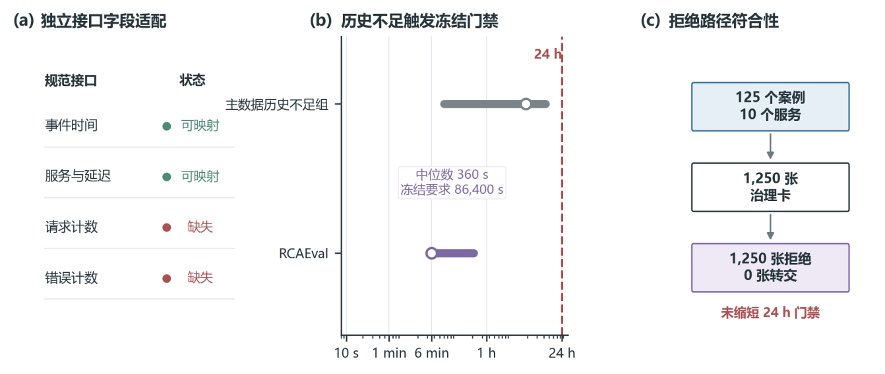

# 论文附录移出的补充记录

本文件保留清稿压缩前的原表号和内容。论文当前表号见 `appendix_numbering.csv`。

下列内容来自已完成研究的归档说明，不代表本次重新收集了人员判断或重新设计了实验。

## 表A1  专家评价、协议冻结与规则修订时间线

可下载记录：[evaluation_freeze_timeline.csv](evaluation_freeze_timeline.csv)。

| 阶段 | 允许的工作 | 冻结边界 |
| --- | --- | --- |
| 第一轮形成性评价 | 识别 24 张阈值合理性较低的卡，形成四状态治理层、证据标记和处置动作 | 第一轮不作为最终专家证据 |
| 第二轮评分前 | 冻结四状态集合、条件、优先级、75% 工程终点、抽样种子和“24 张修复卡＋24 张留出卡”队列 | 留出卡与第一轮卡不重叠；四状态各抽取 6 张 |
| 总体路由结果记录 | 参数配置与总体路由结果采用同一版本归档记录；现有归档可确认其版本状态，但首次查看总体分布的时间点未单独留存 | 状态分布、规则删除、优先级交换及局部敏感性分析用于描述历史v1实例及预设规则变化下的结果，不作为独立预注册的确认性检验。 |
| 第二轮评分后 | 汇总卡级中位数、配对方向、评价者差异和一致性 | 不新增、删除或重定义主状态，不修改候选值、窗口、检查条件或留出抽样 |
| 盲态处置评价 | 从未进入前两轮评价的父卡抽取32张新卡；冻结四路由×难度×SLI 配额、三套呈现顺序和主要终点后，由3名新评价者四选一处置 | 隐藏证据状态、治理标记、建议动作和路由名称；正式结果前不改协议标签或配额 |
| 双向接口检查与配置敏感性 | 先冻结14个接口边界用例和540组配置，再运行生产路由与原始观测数据重建 | 不依据结果修改冻结主配置；RCAEval 仅保留为拒绝路径负对照 |
| B/D边界修订与独立评价 | 首次盲态结果锁定后冻结v1.1、M1—M4、24张新卡的6/6/4/4/4分层、三套顺序、主要终点和主bootstrap；随后回收3名新评价者的72次判断 | 规则和样本不按第二组结果调整；姓名与签名不收集；分层bootstrap明确作为主分析后的敏感性分析 |

## 表A2  第二轮问卷原题、变量名与正文报告名映射

可下载记录：[questionnaire_mapping_full.csv](questionnaire_mapping_full.csv)。

| 问卷原题 | 变量名 | 正文报告名 | 测量对象 |
| --- | --- | --- | --- |
| 原始阈值是否可作为候选起点 | threshold_plausibility | 候选值合理性 | 评价者对候选数值作为讨论起点的判断 |
| 加入治理状态后是否能支持运行时处置 | runtime_actionability | 运行时处置可操作性 | 评价者对所示卡片支持下一处置的判断 |
| 证据不足或异常标志是否准确 | evidence_flag_correctness | 证据标记正确性 | 评价者对卡片证据标记与所示信息一致性的判断 |
| 继续确认、拒绝操作化或要求上下文审查是否合理 | governance_appropriateness | 处置适当性 | 评价者对所示下一处置内容的适当性判断 |
| 相比只输出阈值，治理信息是否有实际增量 | overall_revision_value | 评价者感知的增量信息 | 评价者对证据状态与处置义务所带来信息增量的判断 |

## 表A3  24张形成性修复卡的补充结果

可下载记录：[formative_repair_cards.csv](formative_repair_cards.csv)。

| 状态 | 卡数 | 处置适当性卡级中位数 | 候选值合理性卡级中位数 |
| --- | --- | --- | --- |
| 历史证据不足 | 7 | 5 | 2 |
| 测量语义未解析 | 16 | 5 | 2 |
| 目标所有者审查候选 | 1 | 5 | 4 |

## 表A4  盲态评价指标与解释边界

可下载记录：[blinded_evaluation_metrics.csv](blinded_evaluation_metrics.csv)。

| 指标 | 结果 | 解释边界 |
| --- | --- | --- |
| 专家—卡盲态一致 | 58/96（60.4%） | 描述评价者对基准处置概念的复现程度 |
| 卡片聚类 bootstrap 95%区间 | 50.0%—70.8% | 10,000次按卡片重抽样，反映本平衡样本的不确定性 |
| 卡片多数票一致 | 19/32（59.4%） | 每卡3名评价者的多数选择与协议一致 |
| nominal Krippendorff's α / Fleiss' κ | 0.302 / 0.295 | 描述评价者间名义尺度一致性 |
| 明显 / 临界案例一致 | 35/48（72.9%）/ 23/48（47.9%） | 难度为抽样前冻结分层 |
| 逐卡用时 | 未采集 | 不报告，也不作替代推断 |
| 揭盲后最终选择 | 58个维持、38个改向基准处置；最终96/96一致 | 记录答案明示后的采纳方向 |

## 表A5  双向接口检查用例与逐项观察结果

可下载记录：[interface_conformance_cases.csv](interface_conformance_cases.csv)。

| 用例 | 预设边界 | 观察结果 | 是否符合预期 |
| --- | --- | --- | --- |
| 接口历史23 h 59 min | 不足24 h，在成卡前拒绝 | 接口拒绝：历史不足 | 是 |
| 接口历史24 h | 达到接口下界 | 成卡并进入目标所有者审查候选 | 是 |
| 历史覆盖率0.49 | 低于0.50门限 | 补充历史证据 | 是 |
| 历史覆盖率0.51 | 高于0.50门限 | 通过覆盖条件，进入目标所有者审查候选 | 是 |
| 有效样本719 | 低于720门限 | 补充历史证据 | 是 |
| 有效样本721 | 高于720门限 | 通过样本条件，进入目标所有者审查候选 | 是 |
| 零错误基线 | 零值含义需要澄清 | 测量语义未解析 | 是 |
| 非零错误基线 | 不命中零值条件 | 进入目标所有者审查候选 | 是 |
| 延迟尾部比9.9 | 低于10.0门限 | 进入目标所有者审查候选 | 是 |
| 延迟尾部比10.1 | 高于10.0门限 | 需上下文审查 | 是 |
| 历史不足与测量问题重叠 | 同时命中两项条件 | 按优先级补充历史证据 | 是 |
| 历史不足与长尾重叠 | 同时命中两项条件 | 按优先级补充历史证据 | 是 |
| 来源信息缺失 | 来源前置检查失败 | 路由前构建失败 | 是 |
| 完全合格卡 | 来源前置检查与三类证据条件均通过 | 进入目标所有者审查候选 | 是 |

## 原图A1 RCAEval真实数据负对照的拒绝路径

图A1(b)采用对数坐标展示审计锚点之前的历史长度。经独立接口适配后，1,250张派生卡均因历史长度未达到基准版本规定的24 h而进入历史证据不足状态。这组负对照用于检验接口对短历史输入的拒绝行为，验证范围限定在候选生成前的历史条件检查。

图中字段适配及短历史结果对应历史接口验证。全部拒绝只支持该输入条件下的拒绝路径判断。
